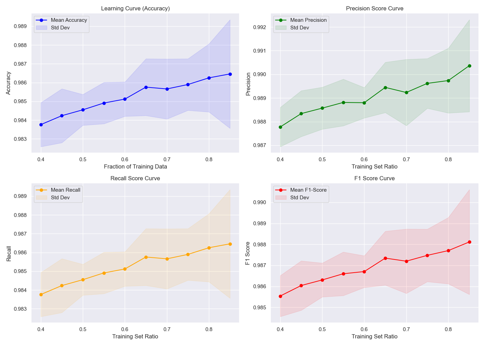
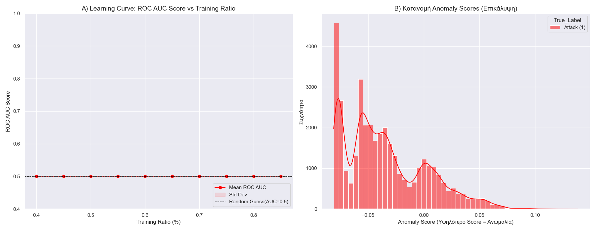
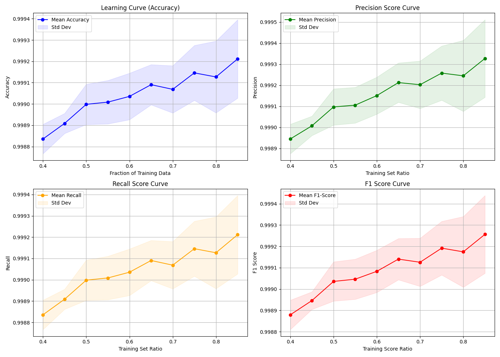

# Benchmarking ML models: Finding the best Algorithm for Network Threat Prediction

## Project Overview

This project is a **systemic comparative study** aimed at identifying the most
effective ML algorithm for **Network Anomaly and Intrusion Detection (NIDS)**, based on
performance metrics

The study trains and evaluates a set of tree-based and ensemble **RandomForestClassifier**,**IsolationForest** and **XGBoostClassifier** on the **NSL-KDD dataset**.
The primary goal is to determine the model that offers the best balance of high **Recall** and **F1-Score** to minimize missed threats (False Negative) 

## Dataset Details

* **File Used:** `KDDTrain.csv` (NSL-KDD).
* **Preprocessing:** Handled internally by a `dataset.data_preprocess()` function (includes encoding of categorical features and feature scaling/normalization).
* **Splitting Method:** Data is split using `train_test_split` with a varying `test_size` (from 0.15 to 0.60) and `stratify=y` (where possible).
* **Training Ratios:** The percentage of data used for training ranges from **40% to 85%** (derived from the test size array `np.arange(0.15, 0.61, 0.05)`).
* **Iterations:** The experiment runs **10 times** for each split ratio, utilizing different `random_state` values starting from 42.

 ## Models 
 **RandomForestClassifier** (supervised algorithm)
 * **Algorithm:** `RandomForestClassifier` (from `sklearn.ensemble`).
* **Model Type:** Supervised Learning (Multi-class Classification).
* **Key Parameter:** `random_state = 42`.
* **Evaluation Metrics:**
    * **Accuracy**
    * **Precision** (weighted average)
    * **Recall** (weighted average)
    * **F1-score** (weighted average)
* **Outputs:** Charts of the **Mean** metrics (Accuracy, Precision, Recall, F1-score) versus the **Percentage of Dataset Used for Training**, including **Standard Deviation** fill-ins.

**IsolationForest** (unsupervised algorithm)
* **Algorithm:** `IsolationForest` (from `sklearn.ensemble`).
* **Model Type:** Unsupervised Anomaly Detection.
* **Key Parameters:**
    * `n_estimators = 100`
    * `contamination = 0.20` (Estimate of the proportion of outliers in the data).
    * `random_state = 42`
* **Objective:** Binary Classification (Attack/Anomaly vs. Normal) after converting the labels (`y = np.where(y == 'attack_class', 0, 1)`).
* **Evaluation Metric:** **ROC AUC Score** (calculated using `-model.decision_function()`).
* **Outputs:**
    * Chart of the **Mean ROC AUC Score** versus the **Percentage of Dataset Used for Training**.
    * Histogram of Anomaly Score Distribution for a sample prediction.

**XGBoostClassifier** (supervised algorithm)
* **Algorithm:** `XGBClassifier` (from `xgboost`).
* **Model Type:** Supervised Learning (Multi-class Classification).
* **Preprocessing Note:** **Rare classes** (classes with only one sample) are explicitly removed from the dataset to ensure proper `stratify` functionality.
* **Key Parameters:**
    * **Objective:** `'multi:softmax'`
    * **Learning Rate:** `0.3`
    * **n_estimators:** `500`
    * **random_state:** `42`
    * **Evaluation Metric (Training):** `'mlogloss'`
* **Evaluation Metrics:**
    * **Accuracy**
    * **Precision** (weighted average)
    * **Recall** (weighted average)
    * **F1-score** (weighted average)
* **Outputs:** Charts of the **Mean** metrics (Accuracy, Precision, Recall, F1-score) versus the **Percentage of Dataset Used for Training**, including **Standard Deviation** fill-ins.

## Training PipeLine
1. ***Preprocessing***
  The main workflow executes the following steps sequentially:

1.  **Load Data and Define Columns:**
    ```python
    # Target: 'attack_class'
    # Categorical: ['protocol_type', 'service', 'flag']
    # To Drop: ['num_outbound_cmds']
    df = pd.read_csv(filename, delimiter=',')
    ```

2.  **Missing Value Imputation:**
    * Fills Numerical NaNs with the **median**.
    * Fills Categorical NaNs with the **mode**.
    ```python
    df = functions.fill_missing_values(df)
    ```

3.  **Column Management:**
    ```python
    df = functions.drop_train_unused(df, columns_to_drop)
    ```

4.  **Target Label Encoding:**
    * The target column (`attack_class`) is converted into numerical codes (e.g., 'normal' -> 1).
    ```python
    y_df, label_map = functions.encode_label(y_df, target_column)
    ```

5.  **Categorical Feature One-Hot Encoding:**
    * Key categorical features are transformed using `pd.get_dummies` (with `drop_first=True`).
    ```python
    X_categorical_encoded = pd.get_dummies(X_categorical, ..., drop_first=True)
    ```

6.  **Feature Scaling (Standardization):**
    * All final features are scaled using `sklearn.preprocessing.StandardScaler`.
    ```python
    scaler = StandardScaler()
    X_scaled_array = scaler.fit_transform(X_intermediate)
2. **RandomForestClassifier Model Training**
    - using traing_test_split in order to split dataset
    - creating train_size(array 0.15-0.60 with 0.05 pace)
    - A set of ten models was generated. Each model comprises ten sub-models, each trained using a varying fraction of the dataset (e.g., Sub-model 1 of Model 1 used 85% of        the data, Sub-model 2 used 80%, and so on).
 
 3. **IsolationForest Model Training**
     - drop labels collun because IsolationForest is an unsupervised algorithm. This algorithm does not build relationships between the data points, but rather isolates the          most 'anomalous' (or 'outlying') data.
     - using traing_test_split in order to split dataset
     - creating train_size(array 0.15-0.60 with 0.05 pace)
     - A set of ten models was generated. Each model comprises ten sub-models, each trained using a varying fraction of the dataset (e.g., Sub-model 1 of Model 1 used 85% of        the data, Sub-model 2 used 80%, and so on).
  
  4. **XGBoostClassifier Model Training**
       - Further data preprocessing was required, as we needed to find values in the 'label' column that appeared fewer than two times.
       - A set of ten models was generated. Each model comprises ten sub-models, each trained using a varying fraction of the dataset (e.g., Sub-model 1 of Model 1 used 85%            of the data, Sub-model 2 used 80%, and so on).
    

  ## Results
 | Model   | Accuracy | Precision | Recall | F1-Score | Notes |
|---------|----------|----------|-------|-------|-------|
| **RandomForestClassifier** | ~98.6%     | ~98.6%    | ~99.1% | ~98.8% |Stable training, strong generalization,Fast training |

| Model   | Accuracy | Precision | Recall | F1-Score |Notes |
|---------|----------|-------|------|------|------|
| **XGBoostClassifier** | ~99.95    |  ~99.97  | ~99.92 | ~99.96 | Stable training, strong generalization |

| Model   | ROC AUC Score  | Notes |
|---------|---------|--------|
| **IsolationForest** |   ~50%   | Fast training, Unsuccessful, Random  |

## Results Overview
### 1. RandomForestClassifier Performance


### 2. IsolationForest Performance


### 3. XGBClassifier Performance



## Requirements
- Python 3.13.2
- NumPy
- Pandas
- XGBoost
- scikit-learn
- Matplotlib
- SeaBorn
